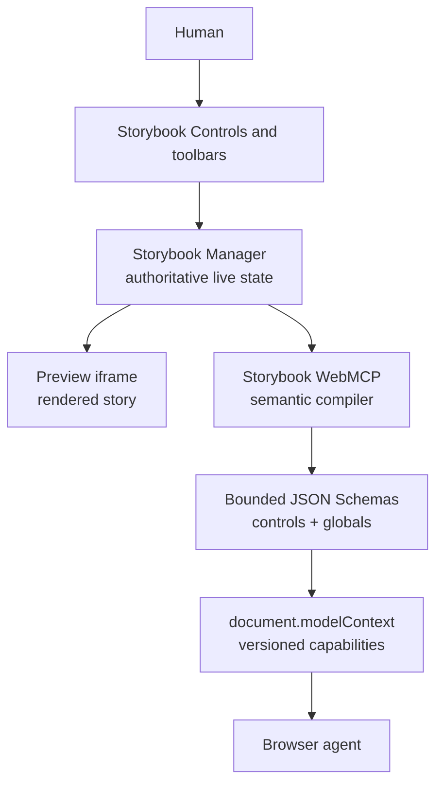
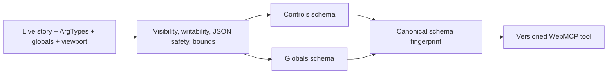

# Storybook WebMCP

**Your agent shouldn't have its own Storybook. It should work in yours.**

_Same story. Same state. Same screen. Human and agent._

[Live Storybook demo](https://storybook-web-mcp.vercel.app/storybook/) · [Public repository](https://github.com/alliecatowo/storybook-webmcp) · [Addon package](./packages/storybook-addon-webmcp/)


▶ [Watch the headless Storybook/WebMCP interaction recording](./packages/storybook-addon-webmcp/evals/artifacts/headless-webmcp-demo.webm)

## What it does

Storybook WebMCP is a generic Manager-side Storybook addon. It compiles the live semantic state of the story a developer is using—stories, ArgTypes, controls, globals, and viewport configuration—into six small, versioned WebMCP capabilities on document.modelContext.

The human and agent operate on Storybook's one authoritative state. A human can drag the ordinary Controls slider and the next agent call sees that value. An agent can patch a safe control or global and the ordinary Controls, toolbar, and Preview update immediately. There is no shadow state, sync backend, MCP server, DOM automation, or agent-specific replica.

## Why WebMCP

Traditional browser automation makes an agent hunt through rendered DOM. Storybook already has the meaning the agent needs: the current story, editable ArgTypes, bounded options, global toolbar values, and configured viewports. WebMCP makes those semantics callable without taking the human out of the Storybook session.

This repository demonstrates the generic addon against a vendored MealDrop Storybook host. MealDrop is only demo input; it is not the product and the addon contains no MealDrop knowledge.

## The golden flow

1. Open Components / Review / Default in the [live demo](https://storybook-web-mcp.vercel.app/storybook/).
2. Ask an agent, “What am I looking at?” The stable storybook_get_context tool returns the story and the editable rating control.
3. Ask, “Make this a one-star review.” The generated controls schema accepts a number from 0 to 5 in 0.1 increments, so the agent sends { "rating": 1 }.
4. Drag the rating to 4.3 yourself. Then ask, “Keep the rating I just chose, but show this in dark mode on a phone.” One globals patch changes theme and viewport while preserving the human's 4.3.
5. Navigate to Components / Icon / Playground. Review's contextual tools disappear; a new schema exposes the actual Icon options. Ask, “Make this a star.”
6. Ask, “Find and open the checkout flow.” The agent searches the Storybook index and opens the matching UserFlows story; its normal Storybook play function runs on render.

The exact two-minute capture script is in [packages/storybook-addon-webmcp/docs/DEMO.md](./packages/storybook-addon-webmcp/docs/DEMO.md).

## Six focused tools

| Tool                             | Lifetime   | Purpose                                                                                 |
| -------------------------------- | ---------- | --------------------------------------------------------------------------------------- |
| storybook_get_context            | Stable     | Read the current story, bounded controls, globals, viewport, and capability identities. |
| storybook_find_stories           | Stable     | Search actual Storybook story-index entries by ID, title, component, or name.           |
| storybook_open_story             | Stable     | Navigate to an exact indexed story and verify the landing story.                        |
| storybook_update_controls.<hash> | Contextual | PATCH the current story's compiled editable controls.                                   |
| storybook_reset_controls.<hash>  | Contextual | Reset all or selected currently editable controls.                                      |
| storybook_update_globals.<hash>  | Contextual | PATCH safe toolbar globals and configured viewport state.                               |

All six tools use untrustedContentHint: true; read-only annotations match their behavior. The contextual names contain an eight-character SHA-256 identity of { storyId, schema }, so an observed old capability can never silently point at a new schema.

## How the product works



The service starts directly from addon registration in the Storybook Manager, before the panel mounts. It reads Manager APIs through one adapter, compiles only safe semantic metadata, and reacts to Storybook lifecycle events. Dynamic registration is aborted and recreated only when the editable capability actually changes; ordinary value edits do not churn tools. Every mutation uses the exact published schema for Ajv 2020-12 runtime validation, checks stale story/hash context, waits for a specific Storybook event, and returns bounded before/after evidence.

See the implementation deep dive in [ARCHITECTURE.md](./packages/storybook-addon-webmcp/docs/ARCHITECTURE.md), the browser API boundary in [WEBMCP.md](./packages/storybook-addon-webmcp/docs/WEBMCP.md), and the threat model in [SECURITY.md](./packages/storybook-addon-webmcp/docs/SECURITY.md).

## Storybook → WebMCP compiler

The compiler is generic. It maps Storybook metadata to JSON Schema without guessing from arbitrary runtime objects:



Examples from the vendored host are computed from its real Storybook metadata, not hard-coded in the addon:

```json
{
  "type": "object",
  "properties": {
    "rating": {
      "type": "number",
      "minimum": 0,
      "maximum": 5,
      "multipleOf": 0.1
    }
  },
  "minProperties": 1,
  "additionalProperties": false
}
```

An Icon story's name becomes a finite enum and size remains numeric. A PATCH schema has no top-level required list, so an agent can change one control without overwriting a human's other choices. Disabled, read-only, hidden conditional, file, function, symbol, non-serializable, and unbounded controls are excluded.

## Human and agent share one state

There is no synchronization service to drift. Both callers use the Storybook Manager APIs that power the human UI. The addon reads state at invocation time, never polls, and never keeps a second copy. Story-locked globals are omitted exactly as they are from the human toolbar. If a human navigates away while an agent holds an old dynamic tool, the closure returns STALE_CONTEXT and performs no mutation.

## Repository boundary

```text
packages/storybook-addon-webmcp/   publishable generic addon
examples/mealdrop/                 vendored Storybook demo host only
packages/.../tests/                compiler, lifecycle, safety, and tool tests
packages/.../evals/                reproducible headless harness and artifacts
```

The addon package has zero imports from examples/mealdrop, no MealDrop story IDs, and no MealDrop theme or icon names. The demo's .storybook/main.ts loads storybook-addon-webmcp and deliberately does not load @storybook/addon-mcp. Storybook's traditional MCP integration is a separate coding-agent workflow; this browser-native addon does not depend on an MCP server.

## Install in your Storybook

The product package is ESM-only and targets Storybook ^10.0.0:

```sh
yarn add -D storybook-addon-webmcp
```

```ts
// .storybook/main.ts
export default {
  addons: ['storybook-addon-webmcp'],
}
```

No Preview entry or backend is required. In browsers without document.modelContext.registerTool, Storybook continues normally and the WebMCP panel reports an unavailable status.

## Run the included demo

The demo is intentionally kept under examples/mealdrop/ so the repository reads as an addon project first:

```sh
yarn install
yarn storybook
```

Open http://localhost:6006/storybook/. The static production build is configured for Vercel and is already live at [storybook-web-mcp.vercel.app/storybook](https://storybook-web-mcp.vercel.app/storybook/):

```sh
yarn build-all
npx vercel --yes --prod
```

## Development and verification

```sh
yarn install --immutable
yarn lint:check
yarn check
yarn vitest run --project=node
yarn build:addon
yarn build-storybook
```

Vitest is the only test runner. The headless harness in [packages/storybook-addon-webmcp/evals](./packages/storybook-addon-webmcp/evals) records measured registration/lifecycle evidence through a local document.modelContext polyfill; it is clearly labeled as a compatibility harness, not a claim of native browser-agent validation.

## Hackathon submission

The challenge work is everything in packages/storybook-addon-webmcp/: the addon shell, Manager adapter, semantic compilers, WebMCP registry and lifecycle, six tools, diagnostic panel, tests, docs, and eval harness. examples/mealdrop/ is pre-existing demonstration material vendored only to provide a realistic Storybook host.

- [Submission packet](./packages/storybook-addon-webmcp/docs/SUBMISSION.md)
- [Architecture](./packages/storybook-addon-webmcp/docs/ARCHITECTURE.md)
- [Security](./packages/storybook-addon-webmcp/docs/SECURITY.md)
- [Browser API boundary](./packages/storybook-addon-webmcp/docs/WEBMCP.md)
- [Demo/capture script](./packages/storybook-addon-webmcp/docs/DEMO.md)
- [Challenge notes](./packages/storybook-addon-webmcp/docs/CHALLENGE.md)

## License

The addon is MIT licensed: [packages/storybook-addon-webmcp/LICENSE](./packages/storybook-addon-webmcp/LICENSE).
