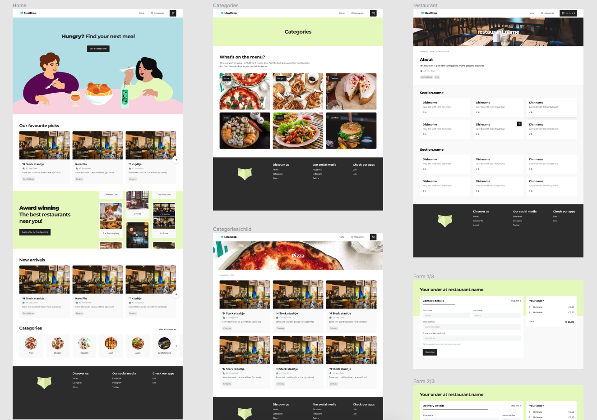

# Storybook WebMCP

**Your agent shouldn't have its own Storybook. It should work in yours.**

**Same story. Same state. Same screen. Human and agent.**

Storybook WebMCP is a generic Storybook addon that compiles the semantic state of the Storybook a human is using—stories, ArgTypes, controls, globals, and viewport configuration—into a small, dynamically typed [WebMCP](https://github.com/webmachinelearning/webmcp) capability surface for a browser agent.

The human and agent operate on Storybook's one authoritative Manager state. There is no agent-specific UI, shadow state, synchronization backend, MCP server, or DOM automation layer.



## What it does

Open any Storybook story. The addon exposes three stable tools for context, story search, and navigation, then compiles the current story's safe editable controls and globals into versioned tools with exact JSON Schemas. A human can drag a control, and the next agent call sees that value. An agent can update a control, and the ordinary Storybook Controls and Preview update immediately.

## Golden flow

1. Open `Components / Review / Default`.
2. Ask an agent what is on screen; it reads `storybook_get_context`.
3. Ask it to make the review one star; it uses the generated numeric schema (`0`–`5`, step `0.1`).
4. Drag the rating to `4.3` yourself, then ask for dark mode on a phone; one globals patch preserves `4.3` while changing theme and viewport.
5. Navigate to `Components / Icon / Playground`; the Review capability disappears and an Icon schema appears.
6. Ask the agent to make the icon a star, then search for and open the checkout flow.

The ready-to-record script is in [`packages/storybook-addon-webmcp/docs/DEMO.md`](./packages/storybook-addon-webmcp/docs/DEMO.md).

## Install

For a consumer Storybook, add the addon by package name:

```ts
// .storybook/main.ts
export default {
  addons: ['storybook-addon-webmcp'],
}
```

The package is ESM-only, Manager-only, and has a peer dependency on Storybook `^10.0.0`.

## How it works

```text
Storybook Manager state
  stories · ArgTypes · args · globals · viewport
                    │
                    ▼
       bounded semantic compiler
          │                  │
          ▼                  ▼
   controls JSON Schema   globals JSON Schema
          │                  │
          └──────────┬───────┘
                     ▼
       versioned document.modelContext tools
                     ▼
                browser agent
```

Registration lives in the Storybook Manager document and follows Storybook lifecycle events. Dynamic tool names include an eight-character SHA-256 identity of `{ storyId, schema }`; ordinary value changes therefore do not churn the tool surface, while story navigation and conditional-control changes do. Every mutation validates against the same schema it published, checks for stale story/capability state, waits for a specific Storybook event, and returns bounded before/after evidence.

See [`ARCHITECTURE.md`](./packages/storybook-addon-webmcp/docs/ARCHITECTURE.md), [`SECURITY.md`](./packages/storybook-addon-webmcp/docs/SECURITY.md), and [`WEBMCP.md`](./packages/storybook-addon-webmcp/docs/WEBMCP.md) for the implementation contract and threat model.

## The addon package

The publishable product is isolated in [`packages/storybook-addon-webmcp`](./packages/storybook-addon-webmcp/). Its package README documents the compiler rules, exact six-tool surface, lifecycle, security bounds, development commands, and license.

## Demo host: MealDrop

This repository keeps Yann Braga's MealDrop fork as a real-world Storybook demonstration host. It is demo input, not product code: the addon imports no MealDrop source, story IDs, components, or theme names. The demo deliberately loads `storybook-addon-webmcp` and does not load `@storybook/addon-mcp`.

The boundary and demo-only instructions are in [`examples/mealdrop/README.md`](./examples/mealdrop/README.md). The upstream app layout remains at the repository root because its Vite and Storybook configuration depend on those paths; this does not affect consuming or publishing the addon package.

Run the demo:

```sh
yarn install
yarn storybook
```

Then open `http://localhost:6006/storybook/` in a WebMCP-capable browser. In a browser without WebMCP, Storybook continues normally and the panel reports that WebMCP is unavailable.

## Six tools

| Capability                         | Lifetime   | Purpose                                                                                          |
| ---------------------------------- | ---------- | ------------------------------------------------------------------------------------------------ |
| `storybook_get_context`            | Stable     | Read the current story, bounded editable controls, globals, viewport, and capability identities. |
| `storybook_find_stories`           | Stable     | Search actual Storybook story-index entries by ID, title, component, or name.                    |
| `storybook_open_story`             | Stable     | Navigate to an exact indexed story and verify the landing story.                                 |
| `storybook_update_controls.<hash>` | Contextual | PATCH the current story's compiled editable controls.                                            |
| `storybook_reset_controls.<hash>`  | Contextual | Reset all or a selected subset of the current editable controls.                                 |
| `storybook_update_globals.<hash>`  | Contextual | PATCH safe toolbar globals and configured viewport state.                                        |

All six tools set `untrustedContentHint: true`; read-only annotations match their behavior. No MCP Resources, Prompts, Sampling, Channels, transport, server, or Preview-frame registration is implemented.

## Development and verification

```sh
yarn install
yarn lint:check
yarn check
yarn vitest run --project=node
yarn build:addon
yarn build-storybook
```

The reproducible headless production-build shim is documented in [`packages/storybook-addon-webmcp/docs/EVALS.md`](./packages/storybook-addon-webmcp/docs/EVALS.md). It is labeled separately from native Chrome WebMCP/agent validation and never presented as a substitute for that real-browser run.

## Deployment

The demo is configured for a static Vercel deployment (`vercel.json`):

```sh
npx vercel --yes --prod
```

The build output is `build`, with Storybook available below `/storybook/`.

## Hackathon work and license

The MealDrop application and its original Storybook stories are pre-existing demonstration material. **Storybook WebMCP**—the addon package, compiler, Manager runtime, WebMCP tools, panel, tests, docs, and integration wiring—is the work submitted for the OpenAI WebMCP Challenge.

The addon is MIT licensed; see [`packages/storybook-addon-webmcp/LICENSE`](./packages/storybook-addon-webmcp/LICENSE).
