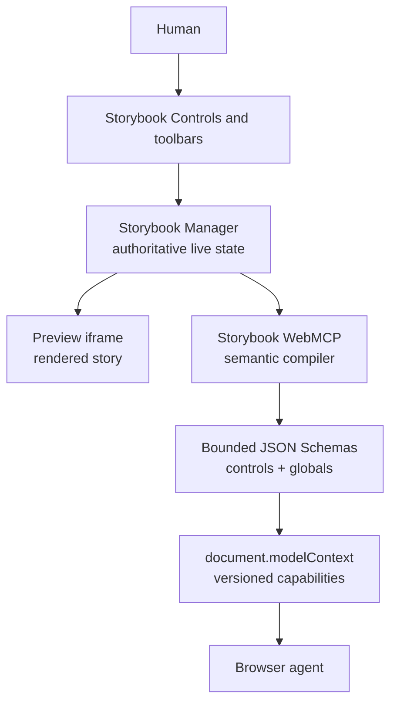
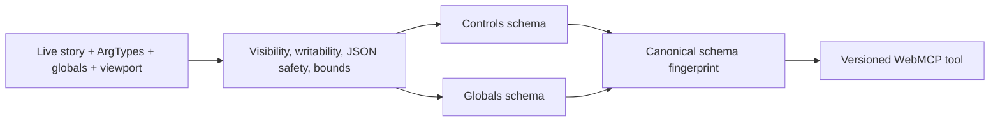

# How it works




The service starts directly from addon registration in the Storybook Manager, before the panel mounts. It reads Manager APIs through one adapter, compiles only safe semantic metadata, and reacts to Storybook lifecycle events. Dynamic registration is aborted and recreated only when the editable capability actually changes; ordinary value edits do not churn tools. Every mutation uses the exact published schema for Ajv 2020-12 runtime validation, checks stale story/hash context, waits for a specific Storybook event, and returns bounded before/after evidence.

See the implementation deep dive in [ARCHITECTURE.md](https://github.com/alliecatowo/storybook-webmcp/blob/main/packages/storybook-addon-webmcp/docs/ARCHITECTURE.md), the browser API boundary in [WEBMCP.md](https://github.com/alliecatowo/storybook-webmcp/blob/main/packages/storybook-addon-webmcp/docs/WEBMCP.md), and the threat model in [SECURITY.md](https://github.com/alliecatowo/storybook-webmcp/blob/main/packages/storybook-addon-webmcp/docs/SECURITY.md).

## Storybook → WebMCP compiler

The compiler is generic. It maps Storybook metadata to JSON Schema without guessing from arbitrary runtime objects:



Examples from the vendored host are computed from its real Storybook metadata, not hard-coded in the addon:

```json
{
  "type": "object",
  "properties": {
    "rating": {
      "type": "number",
      "minimum": 0,
      "maximum": 5,
      "multipleOf": 0.1
    }
  },
  "minProperties": 1,
  "additionalProperties": false
}
```

An Icon story's name becomes a finite enum and size remains numeric. A PATCH schema has no top-level required list, so an agent can change one control without overwriting a human's other choices. Disabled, read-only, hidden conditional, file, function, symbol, non-serializable, and unbounded controls are excluded.

## Human and agent share one state

There is no synchronization service to drift. Both callers use the Storybook Manager APIs that power the human UI. The addon reads state at invocation time, never polls, and never keeps a second copy. Story-locked globals are omitted exactly as they are from the human toolbar. If a human navigates away while an agent holds an old dynamic tool, the closure returns STALE_CONTEXT and performs no mutation.

## Repository boundary

```text
packages/storybook-addon-webmcp/   publishable generic addon
examples/mealdrop/                 vendored Storybook demo host only
packages/.../tests/                compiler, lifecycle, safety, and tool tests
packages/.../evals/                reproducible headless harness and artifacts
```

The addon package has zero imports from examples/mealdrop, no MealDrop story IDs, and no MealDrop theme or icon names. The demo's .storybook/main.ts loads storybook-addon-webmcp and deliberately does not load @storybook/addon-mcp. Storybook's traditional MCP integration is a separate coding-agent workflow; this browser-native addon does not depend on an MCP server.
