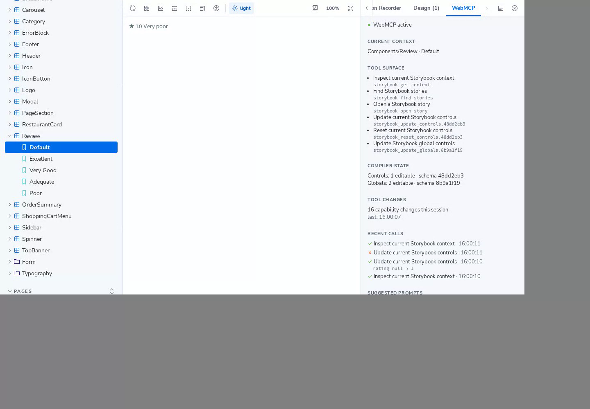

<h1><span class="sb-prompt">$</span> Your agent shouldn't have its own Storybook. It should work in yours.</h1>
<p class="sb-lede">A Manager-side Storybook addon that turns the story you have open, with its controls, globals and viewport, into WebMCP tools for browser agents. No MCP server, no shadow state, no DOM automation.</p>
<div class="sb-actions">
  <a class="sb-primary" href="https://storybook-web-mcp.vercel.app/storybook/">try the live demo</a>
  <a href="./guide/getting-started">get started</a>
  <a href="https://github.com/alliecatowo/storybook-webmcp">github</a>
</div>

```sh
npm install -D storybook-addon-webmcp
```

Published on npm as [`storybook-addon-webmcp`](https://www.npmjs.com/package/storybook-addon-webmcp). ESM-only, requires Storybook ^10.0.0. Register it:

```ts
// .storybook/main.ts
export default {
  addons: ["storybook-addon-webmcp"],
};
```

No Preview entry or backend is required. In browsers without `document.modelContext.registerTool`, Storybook runs as normal and the WebMCP panel reports that WebMCP is unavailable. See [Getting started](/guide/getting-started).

## try it now

This is the deployed Storybook, running the addon against a demo host (MealDrop). Open the WebMCP panel to see the tools. Agent calls work in a browser that implements WebMCP; the panel and ordinary Storybook controls work everywhere.

<div class="sb-demo">
<iframe src="https://storybook-web-mcp.vercel.app/storybook/?path=/story/components-review--default" title="Storybook WebMCP live demo" loading="lazy"></iframe>
</div>
<p class="sb-note">Prefer a full tab? <a href="https://storybook-web-mcp.vercel.app/storybook/?path=/story/components-review--default" target="_blank" rel="noopener">Open the demo</a>. The <a href="./guide/overview">overview</a> walks through a six-step flow to try with an agent.</p>

## the panel

<div class="sb-crop"></div>
<p class="sb-note">The WebMCP panel in the demo Storybook, after an agent set the review rating to 1.</p>

## what you get

<dl class="sb-facts">
  <dt>one state</dt>
  <dd>Human and agent use the same Storybook Manager APIs. Drag a control yourself and the agent's next call sees it.</dd>
  <dt>six tools</dt>
  <dd>Three stable (<code>get_context</code>, <code>find_stories</code>, <code>open_story</code>) and three contextual tools for controls and globals that follow the open story.</dd>
  <dt>generated schemas</dt>
  <dd>ArgTypes and globals become bounded JSON Schema. Controls that are unsafe to expose are excluded.</dd>
  <dt>versioned names</dt>
  <dd>Contextual tool names carry a hash of the story and schema, so an old capability cannot silently point at a new schema.</dd>
  <dt>honest annotations</dt>
  <dd>All tools are marked as returning untrusted content, and read-only annotations match their behavior.</dd>
  <dt>degrades quietly</dt>
  <dd>Without WebMCP support Storybook continues normally and the panel says so.</dd>
</dl>

## docs

Start with [Getting started](/guide/getting-started), then [what it does](/guide/overview), the [tools](/guide/tools), [how it works](/guide/how-it-works), and [security](/reference/security). Source is on [GitHub](https://github.com/alliecatowo/storybook-webmcp) (MIT).
