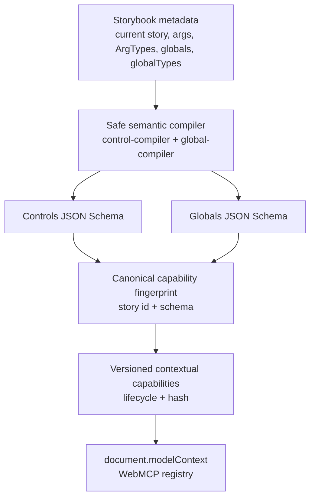

# Architecture

Your agent shouldn't have its own Storybook. It should work in yours.
Same story. Same state. Same screen. Human and agent.

This document explains how `storybook-addon-webmcp` turns Storybook's own live
metadata into a WebMCP tool surface, and points at the exact source file that
implements each piece. Section numbers (`§N`) refer to `docs/SPEC.md`.

## The pipeline



Storybook metadata is never handed to an agent as-is. It first passes through
a compiler that only emits a control or global if it can prove the value is
bounded, JSON-safe, and currently visible/writable (§11–§15). The compiler's
output is fingerprinted into a capability — a schema plus the story id it
belongs to (§17) — and only the fingerprinted, versioned capability is ever
registered as a WebMCP tool. Nothing upstream of that fingerprint is ever
exposed directly.

## Manager vs Preview

Storybook is two documents: the **Manager** (the top-level UI — sidebar,
toolbars, addon panels) and the **Preview** (the iframe that renders the
story itself). The addon's WebMCP runtime lives entirely in the Manager.

`src/manager.tsx` is the only entry point Storybook loads for this addon
(`src/preset.ts` deliberately does not add a `managerEntries`/preview
annotation, to avoid double-registering the Manager entry and starting the
service twice). Registration happens inside `addons.register`, unconditionally,
before the diagnostic panel is even added (§24):

```ts
addons.register(ADDON_ID, (api) => {
  const service = startWebMCPService(api)   // src/webmcp/service.ts
  ...
  addons.add(PANEL_ID, { ... })             // src/panel/Panel.tsx
})
```

The Manager owns registration, not the Preview, for two concrete reasons:

1. **`document.modelContext` needs to be the same document a human is looking
   at.** The Manager is the top-level document — sidebar, controls, toolbars
   all live there. Registering tools in the Preview iframe would put the
   WebMCP surface in a document the human never directly interacts with, and
   would require crossing an iframe boundary the spec explicitly rules out
   (§2: no cross-frame WebMCP).
2. **The Manager is the one place Storybook's live state already lives.**
   `api.getCurrentStoryData()`, `api.getGlobals()`, `api.getArgTypes()` are
   Manager APIs. Reading them from the Preview would mean re-deriving or
   mirroring state that the Manager already has authoritatively (see below).

Storybook's internal Manager↔Preview channel (`api.getChannel()`, used in
`storybook-adapter.ts` to listen for `STORY_CHANGED` etc.) is Storybook's own
implementation plumbing for keeping those two documents in sync. The addon
consumes it as an event source; it is never exposed as a protocol feature of
the product itself (§2).

### Why registration cannot depend on the panel (§24)

`addons.register(ADDON_ID, api => { ... })` runs once, unconditionally, the
moment Storybook's Manager loads this addon — independent of whether a human
ever opens the WebMCP panel. `src/manager.tsx` calls `startWebMCPService(api)`
and only afterward calls `addons.add(PANEL_ID, { render: ... })`; the service
is fully running, with the three stable tools already registered, before the
panel type is even declared to Storybook. This ordering is load-bearing, not
cosmetic: starting the service from the panel's React component instead — on
mount, or gated behind "panel is active" — would mean a browser agent driving
Storybook with the WebMCP panel never opened finds no tools registered at
all, since nothing else in the addon would ever call
`startWebMCPService`. The service's lifetime is the Manager's lifetime; the
panel is purely a `subscribe`/`getState` observer of whatever the service is
already doing (`src/panel/panel-store.ts`), and can be closed, reopened, or
never opened without the tool surface being affected.

## Authoritative state: one state, no mirror, no polling

`src/storybook/storybook-adapter.ts` is the single module that touches the
Storybook Manager API (§23). Every other module in the addon — the
compilers, the lifecycle brain, the tools, the panel — only ever sees the
adapter's `StorybookAdapter` interface and the plain `StorybookState` object
it returns from `readState()`. Direct `storybook/internal/*` imports are
confined to the adapter/conditional boundary: `storybook-adapter.ts` imports
`storybook/internal/core-events` for the event names it listens/waits on and
calls Storybook's `includeConditionalArg` helper at that same boundary (see
below). `panel/Panel.tsx` uses only React and its own small layout primitives;
it does not import Storybook internals or acquire Manager state.

There is exactly one authoritative state: whatever `api.getCurrentStoryData()`,
`api.getArgs()`, `api.getGlobals()`, etc. return live from the Manager. The
addon:

- **never mirrors** that state into a second copy,
- **never polls** it (no `setInterval`, no repeated `getCurrentStoryData()`
  calls off a timer),
- reads it **exactly when needed**: once per WebMCP tool execution, and once
  per lifecycle event.

Every adapter read method (`getCurrentStory`, `getArgs`, `getGlobals`, ...) is
a synchronous pass-through to the corresponding Manager API call, wrapped in
a `try`/`catch` that degrades to an empty/`null` value rather than throwing.
This is what makes "the agent sees what the human sees" a structural
guarantee rather than a best-effort one: there is nothing to fall out of
sync, because there is nothing else being kept.

### Reads must be detached copies, not live references

Reading "the same live state" is not the same as handing out the same live
_object_. Storybook's Manager API (`api.getArgs()`, `api.getGlobals()`, ...)
returns references into its own internal state; mutating a global through
`api.updateGlobals()` mutates that exact object in place. If the adapter
returned those references directly, a mutation tool that snapshots "before",
performs the update, and re-reads "after" to build the §20 evidence diff
would find both variables pointing at the very same (now-mutated) object —
the "before" value would already equal "after", and every mutation would
report zero changes even though Storybook's UI visibly updated. `detach()` in
`storybook-adapter.ts` exists precisely to close this hole: every state-object
read (`getArgs`, `getGlobals`, `getUserGlobals`, `getStoryGlobals`) shallow-
copies the top level and one level deeper for nested records such as
`globals.viewport`, so a "before" snapshot taken through the adapter is
frozen at the moment it was read, independent of whatever Storybook does to
its own internal object afterward. This is what makes the mutation result
contract's `changes[].before`/`after` pairs (§20) truthful rather than
coincidentally-always-equal.

## Lifecycle and the churn invariant

`src/storybook/lifecycle.ts` is the capability lifecycle brain (§17, §19,
§26, §27). It has two jobs: build a `CapabilitySnapshot` from a
`StorybookState`, and decide when a new snapshot actually differs from the
previous one.

```
Storybook event            lifecycle.ts                          service.ts / registry.ts
──────────────────         ──────────────────────────────        ──────────────────────────
story-changed        ──►   onStoryChanged() fires,           ──►  registry.clearDynamic()
                            no snapshot is built                   (abort dynamicController)

story-prepared         ──► buildSnapshot()                   ──►  sameSnapshot()? skip.
args-updated            ──► (compileControls + compileGlobals      Different? registry
globals-updated         ──►  + capabilityHash)                     .registerDynamic(newTools)
```

`watchLifecycle()` subscribes to `story-changed`, `story-prepared`,
`args-updated`, and `globals-updated` (via `adapter.subscribeToLifecycle`,
which listens on the Manager channel for `STORY_CHANGED`, `STORY_PREPARED`,
`STORY_ARGS_UPDATED`, `GLOBALS_UPDATED`). `story-changed` is handled specially
and does _only_ one thing — it calls `onStoryChanged`, which the service wires
to `registry.clearDynamic()` — and deliberately does **not** build a snapshot
in the same handler: the new story's args/argTypes are not guaranteed to be
ready yet when `story-changed` fires, so building a snapshot from it could
register a capability off stale or half-loaded state. The transition window
between one story and the next therefore has zero contextual tools registered
(cleared by `story-changed`) rather than a stale set, until the _separate_
`story-prepared` event (fired once Storybook has finished loading the new
story) triggers the next `buildSnapshot()` (§27).

Every other event triggers `buildSnapshot()` again, but a rebuild does not
imply a re-registration. `sameSnapshot()` (in `lifecycle.ts`) compares two
snapshots by **identity** — story id plus each capability's hash — not by
content. `service.ts`'s `onSnapshot` handler only calls
`registry.registerDynamic()` when `sameSnapshot()` returns `false`. This is
the churn invariant from §27:

> State changes do not cause capability churn unless they actually change
> what can be done.

Concretely: editing a rating from `1` to `4.3` recomputes a snapshot whose
schema (and therefore hash) is identical, so no re-registration happens, no
`toolchange` fires, and no browser agent observes a tool surface change. A
conditional arg becoming visible/hidden, or navigating to a different story,
changes the compiled schema and therefore the hash, which does trigger
`registry.registerDynamic()` (`src/webmcp/registry.ts`) to abort the previous
`dynamicController` and register a fresh set of contextual tools under a new
`AbortController` (§26). Aborting the controller is the _only_ unregistration
mechanism in the addon — there is no separate "unregister" call.

`src/webmcp/service.ts` is the module that wires all of this into one
Manager-session-scoped runtime: it builds the adapter, registers the three
stable tools once via `registry.registerSession()` (§25), starts
`watchLifecycle`, and exposes a `PanelState` (via `subscribe`/`getState`) that
the diagnostic panel observes — the panel never drives registration itself.

## Conditional controls via Storybook's own semantics

`src/storybook/conditional.ts` decides whether an ArgType with an `if`
predicate is currently visible, and it does so by calling Storybook's own
`includeConditionalArg` from `storybook/internal/csf` rather than
reimplementing `argTypes.if` matching:

```ts
export function isConditionallyVisible(argType, args, globals): boolean {
  if (no `if` on argType) return true
  try {
    return includeConditionalArg(argType, args, globals)
  } catch {
    return false   // a malformed `if` config hides the control, never crashes
  }
}
```

This guarantees the WebMCP-visible control set always matches what the
Controls addon panel shows a human — the addon never has its own opinion
about what "visible" means (§12). `control-compiler.ts` calls this for every
ArgType before deciding whether to compile it; a control considered hidden
here is skipped entirely, the same as `control === false` or
`table.disable === true`.

## Capability versioning: why tool names carry a hash

`src/core/hash.ts` computes `capabilityHash(storyId, schema)`: canonicalize
`{ storyId, schema }` with recursively sorted keys (`core/canonicalize.ts`),
SHA-256 it via `globalThis.crypto.subtle`, and take the first 8 lowercase hex
characters (`HASH_LENGTH` in `core/constants.ts`). The hash becomes the
machine-readable suffix of the tool name:

```
storybook_update_controls.48dd2eb3
storybook_reset_controls.48dd2eb3
storybook_update_globals.8b9a1f19
```

The hash depends only on the story id and the compiled schema shape — never
on current control _values_ — so ordinary value edits never change it
(§17). It changes exactly when the compiled schema itself changes: a
different story, or a conditional control appearing/disappearing.

Tool names are versioned rather than reused under a stable machine name
because a browser agent may have already read and cached an older tool
definition (its `inputSchema`) before the story or its args changed. If the
addon replaced a hash-suffixed controls definition in place, a
stale agent could submit a value shaped for the old schema against a tool
that now means something else. Versioning the name makes that impossible: an
agent holding a stale name either calls a tool that no longer exists (fails
cleanly) or, if reused fast enough to collide, cannot — the hash is derived
from content, so two different schemas cannot produce the same suffix except
by a SHA-256 collision. The human-facing `title` (e.g. "Update Storybook
controls") stays stable across hash changes; only the machine identity moves
(§18).

## Stale protection

Every dynamic tool closure (`update-controls.ts`, `reset-controls.ts`,
`update-globals.ts`) captures the `Capability` (`storyId` + `hash`) it was
built from at registration time. Before performing any mutation, it calls
`assertFresh()` in `lifecycle.ts`:

```
1. read current Storybook story (adapter.readState())
2. if current story id !== expected.storyId          → STALE_CONTEXT
3. recompile only the capability being mutated
4. recompute its hash
5. if recomputed hash !== expected.hash               → STALE_CONTEXT
6. otherwise: proceed with the mutation
```

If either comparison fails, the tool does nothing and returns the standard
`STALE_CONTEXT` error (`core/errors.ts::staleContext()`, §19, §21):

```json
{
  "ok": false,
  "error": {
    "code": "STALE_CONTEXT",
    "message": "The human changed Storybook context after this capability was discovered. Refresh the available tools or inspect the current Storybook context and retry.",
    "retryable": true
  }
}
```

This is what prevents a capability discovered against the "Review" story
from ever mutating "Icon" after the human has navigated away — even if the
agent's copy of the tool name and schema is still technically callable at
the moment it decides to invoke it.

## Result verification: listen first, act, await, read once, verify

Every mutating adapter method in `storybook-adapter.ts`
(`selectStory`, `updateArgs`, `resetArgs`, `updateGlobals`) follows the exact
same event-driven pattern, implemented once in `waitAndVerify()` (§39, §22):

```
attach event listener (api.getChannel().on(...))
        │
        ▼
perform the Storybook API call (api.updateStoryArgs / api.updateGlobals / api.selectStory)
        │
        ▼
await the matching event OR a timeout (1500ms args/globals, 3000ms navigation) OR abort
        │
        ▼
read authoritative state once (adapter.getArgs() / getGlobals() / getCurrentStory())
        │
        ▼
verified = event fired || (final state already matches the requested values)
```

This is not polling: the listener is attached once, before the mutating
call, and the state is read exactly once, after the wait resolves. A missed
event is not automatically a failure — if the final authoritative read
already shows the requested value in place, the operation is still reported
`verified: true`; the addon does not retry blindly (§39). The `verified`
boolean surfaces all the way through `MutationResult`/`OpenStoryResult`
(`core/types.ts`) into the tool's JSON response, so an agent (and the
diagnostic panel) can distinguish "the value changed and Storybook confirmed
it" from "the call returned but nothing was observed to change."

## The panel snapshot must be memoised

The diagnostic panel (§34) reads `PanelState` through React's
`useSyncExternalStore` (`src/panel/panel-store.ts`'s `usePanelState`), which
decides whether to re-render by comparing the object identity of successive
`getSnapshot()` results — not their contents. `src/webmcp/service.ts` builds
that `PanelState` object (`currentState()`), and if it built a fresh object
literal on every call, `getSnapshot()` would return a new identity on every
single read, including the reads React performs purely to check "did
anything change". `useSyncExternalStore` would see a changed identity every
time, re-render, call `getSnapshot()` again, see yet another new identity,
and re-render again — forever, on every tick React can schedule, pinning a
render loop that starves the rest of the Storybook Manager UI.

`service.ts` avoids this with a `cachedState` cell: `currentState()` returns
the cached object unchanged unless `notify()` has explicitly invalidated it
(`cachedState = null`) because something real happened — a lifecycle event
produced a different snapshot, a tool call completed, `toolchange` fired.
Between real changes, repeated `getSnapshot()` calls return the exact same
reference, so `useSyncExternalStore` correctly sees "nothing changed" and
does not re-render. This is a general rule for anything feeding
`useSyncExternalStore` in this addon, not an implementation detail local to
one file: the snapshot function's identity stability is what the hook's
correctness depends on.

## Build constraint: classic JSX, not the automatic runtime

Storybook globalises `react` for addon bundles (so the addon does not ship
its own copy of the React module), but it does **not** globalise
`react/jsx-runtime`. If this package's `.tsx` files were compiled with the
automatic JSX runtime (`jsx: "react-jsx"`), every JSX expression would emit a
call to `react/jsx-runtime`'s `jsx`/`jsxs` from a copy of that module bundled
_into this addon_ — separate from the `react`/`react/jsx-runtime` copy
Storybook's own Manager UI is running. React refuses to accept elements
created by one copy of the runtime inside a tree owned by another copy, so
every element this addon renders would be rejected at runtime.
`tsconfig.json` therefore sets `"jsx": "react"` (the classic runtime,
`React.createElement`), and every `.tsx` file (`manager.tsx`,
`panel/Panel.tsx`, `panel/components.tsx`) keeps an explicit
`import * as React from 'react'` — under the classic runtime that import is
not optional decoration, it is what `React.createElement` resolves against.
Dropping it is caught immediately by `tsc --noEmit` (`"This JSX tag requires
'React' to be in scope"`), so the failure mode this guards against is not a
silent one; it is a hard requirement the typecheck step enforces on every
`.tsx` file in this package.

## Module map

```
src/
├── manager.tsx                     Manager entry: addons.register, starts the
│                                    service unconditionally, adds the panel (§24)
├── preset.ts                       Addon-resolution stub only; no preview entry
├── index.ts                        Public programmatic exports (types, constants,
│                                    hash, compilers) for embedding/testing outside
│                                    the Storybook addon lifecycle
│
├── core/                           Storybook- and DOM-free shared vocabulary
│   ├── types.ts                    JsonSafeValue, JsonSchema, ErrorResult,
│   │                                MutationResult, CapabilitySnapshot, PanelState, ...
│   ├── constants.ts                Addon id, tool name prefixes, every bound
│   │                                (LIMITS), timeouts (TIMEOUTS), HASH_LENGTH
│   ├── canonicalize.ts             canonicalJson(): recursive key-sorted JSON
│   ├── hash.ts                     sha256Hex(), capabilityHash()
│   ├── json.ts                     JSON-safety/truncation primitives
│   ├── errors.ts                   fail() + one builder per ErrorCode
│   └── result.ts                   mutationResult()/openStoryResult() builders
│
├── storybook/                      The only code that talks to the Storybook
│   │                                Manager API
│   ├── storybook-adapter.ts        StorybookAdapter: getArgs/updateArgs/
│   │                                selectStory/etc.; owns waitAndVerify (§39)
│   ├── lifecycle.ts                buildSnapshot, assertFresh, sameSnapshot,
│   │                                watchLifecycle — the capability brain
│   ├── conditional.ts              isConditionallyVisible(), wraps Storybook's
│   │                                includeConditionalArg
│   ├── control-compiler.ts         ArgType → JSON Schema compiler (§11–§15)
│   └── global-compiler.ts          globalTypes/viewport → JSON Schema (§10)
│
├── webmcp/                         The registration layer over document.modelContext
│   ├── webmcp-types.ts             Ambient types for the WebMCP browser API
│   ├── registry.ts                 createRegistry(): session/dynamic
│   │                                AbortControllers, progressive enhancement (§35)
│   ├── validate.ts                 Ajv 2020 runtime validation gate (§16)
│   ├── service.ts                  startWebMCPService(): wires adapter +
│   │                                lifecycle + registry into one Manager-
│   │                                session runtime; exposes PanelState
│   └── tools/
│       ├── get-context.ts          storybook_get_context (§5)
│       ├── find-stories.ts         storybook_find_stories (§6)
│       ├── open-story.ts           storybook_open_story (§7)
│       ├── update-controls.ts      storybook_update_controls.<hash> (§8)
│       ├── reset-controls.ts       storybook_reset_controls.<hash> (§9)
│       └── update-globals.ts       storybook_update_globals.<hash> (§10)
│
└── panel/                          Read-only diagnostic panel (§34); observes
    ├── panel-store.ts               the running service, never drives it
    ├── Panel.tsx
    └── components.tsx
```

The dependency direction is one-way: `core` depends on nothing in this
package; `storybook` depends only on `core`; `webmcp` depends on `core` and
`storybook`; `panel` depends only on `core` and the service's `PanelState`.
`manager.tsx` is the only file that imports from more than one of these
layers to wire them together.
